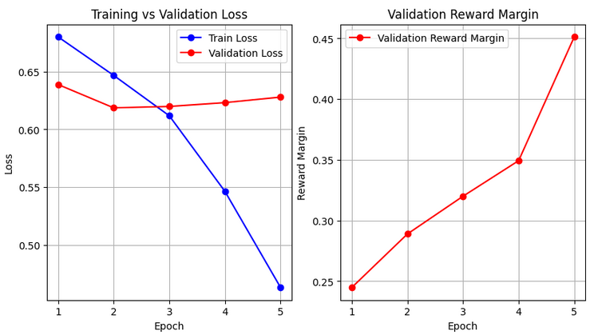
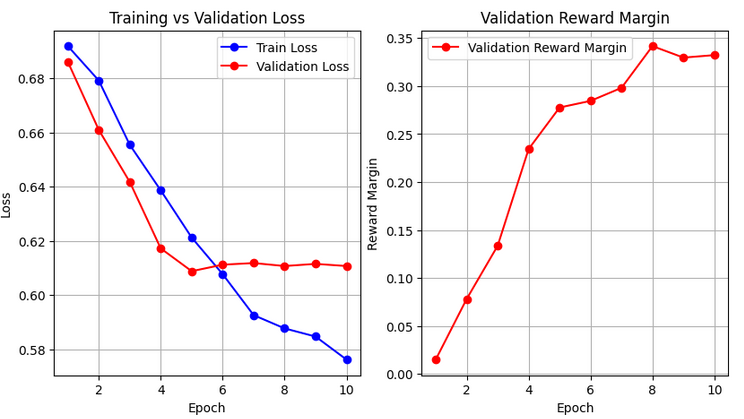
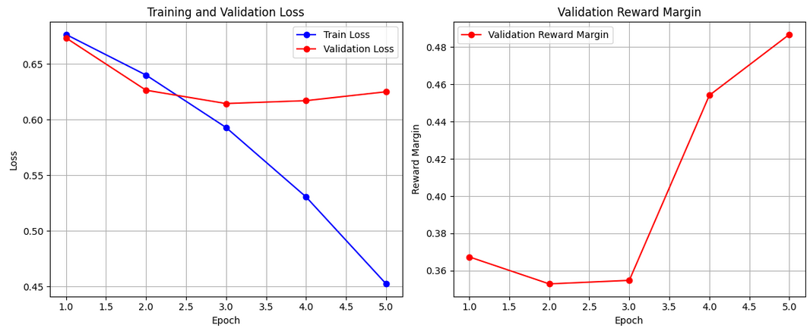
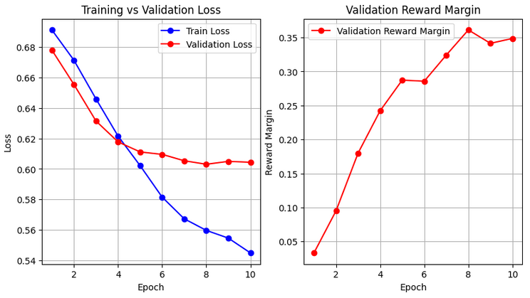

# Direct Preference Optimization

## Used resourses:
* NVIDIA GeForce RTX 3090
* Python 3.12.8

## What was used:
* GPT2 model
* Anthropic/hh-rlhf dataset with 3000 samples for TRAIN/VAL
* Anthropic/hh-rlhf dataset with 500 samples for TEST
* max_length = 256
* batch_size = 16
* device = cuda

## [Link to ckeckpoints](https://disk.yandex.ru/d/VwVExhptubkUWw)

## Instructions to run DPO
- Load checkpoints to use for test
- Run docker and commands:
```
docker build -t dpo .
docker run -it -v $(pwd):/app dpo

# run train
python main.py --mode train

# run test
python main.py --mode test --checkpoint_dir checkpoints/checkpoint_beta0.3
```


## Implementation details
I saved checkpoints for every epochs and for multiple beta parameters - (0.3, 0.5, 0.7)

Overall, after tested possible hyperparameters beta and lr, chosen reward and rejected reward both were negative. Still model ranked chosen higher than rejected.

With param beta=0.3, lr=1e-4, epochs=5:
While analysing train and val statistic, after 3 epochs already model started to overfit, but reward only increased.


With param beta=0.3, lr=1e-5, epochs=10:
I wanted to test if for lower beta we need lower lr. 
While analysing train and val statistic, after 5 epochs already model started to overfit, but reward only increased.

Beta = 0.3 with different lr achived loss ~ 0.61.

With param beta=0.5, lr=1e-4, epochs=5:
While analysing train and val statistic, after 2 epochs already model started to overfit, but reward only increased.
I saved in the end for test checkpoint for epoch2.


With param beta=0.7, lr=1e-5, epochs=10:
I wanted to test if for lower beta we need lower lr. 
While analysing train and val statistic, after 4 epochs already model started to overfit, but reward only increased.

